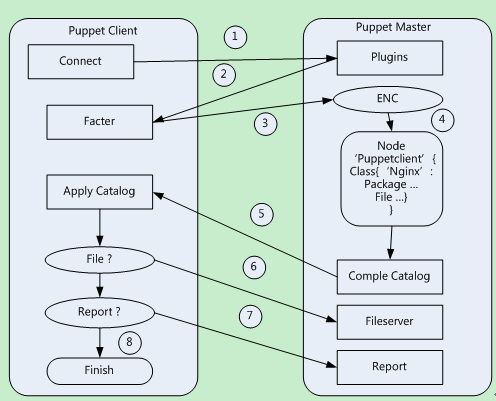

# Facter

---


https://docs.puppet.com/facter/

`FACTER` is Puppet’s cross-platform system profiling library. It discovers and reports per-node facts, which are available in your Puppet manifests as variables.

`FACTS` - `:key => :value` pairs, describing something


---



 1. The client initiates the authentication request to the master.
 2. Puppet Master told client is legal and asks for facts
 3. Return facts to master
 4. Prepare and compile catalog
 5. Send catalog to clinet
 6. Execute catalog
 7. Init reporting system
 8. Report

---

## System facts.

facter comes along puppet client. There are a number of facts (~90) comming with the package

```bash
#bash> facter
ipaddress => 141.5.6.111
ipaddress_ens192 => 141.5.6.111
ipaddress_lo => 127.0.0.1
...
swapfree => 637.84 MB
swapfree_mb => 637.84
swapsize => 1024.00 MB
swapsize_mb => 1024.00
...

```

using it (on the client)

```bash
# show all facter facts
facter

# show all facter facts, and those defined for use in puppet (run as root)
facter -p
```

## Accessing facts in puppet manifests
Facts are in __global__ scope, so

```
notify{"My IP is: $::ipaddress":
}
```

## Custom facts

### On the node - a hard way.

Create a custom fact on a client

`/usr/share/ruby/vendor_ruby/facter/hardware_platform.rb`

```ruby
# hardware_platform.rb

Facter.add('hardware_platform') do # same as filename
  setcode do
    Facter::Core::Execution.exec('/bin/uname --hardware-platform')
  end
end
```

### Place facts in to modules:

* enable pluginsync. This requires `pluginsync=true` in the [main] section of `puppet.conf` on the server.

you could create facts inside modules

```
#~/lib/ruby
└── facter
    └── hardware_platform.rb
```

On the client:

```
puppet agent -t # by the first run your fact would be copied to the client
                # this is visible in log output.
facter -p       # get the key=>value of all facts.. search for `hardware_platform`
```

### Using other facts

we have those facts in the system:

```bash
operatingsystem => CentOS
operatingsystemmajrelease => 7
operatingsystemrelease => 7.2.1511
```

So lets bring them together

```ruby
Facter.add('complex') do # same as filename
  setcode do
    complex = Facter.value(:operatingsystem) + " " + Facter.value(:operatingsystemmajrelease) + " " + Facter.value(:operatingsystemrelease)
    complex
  end
end
```
